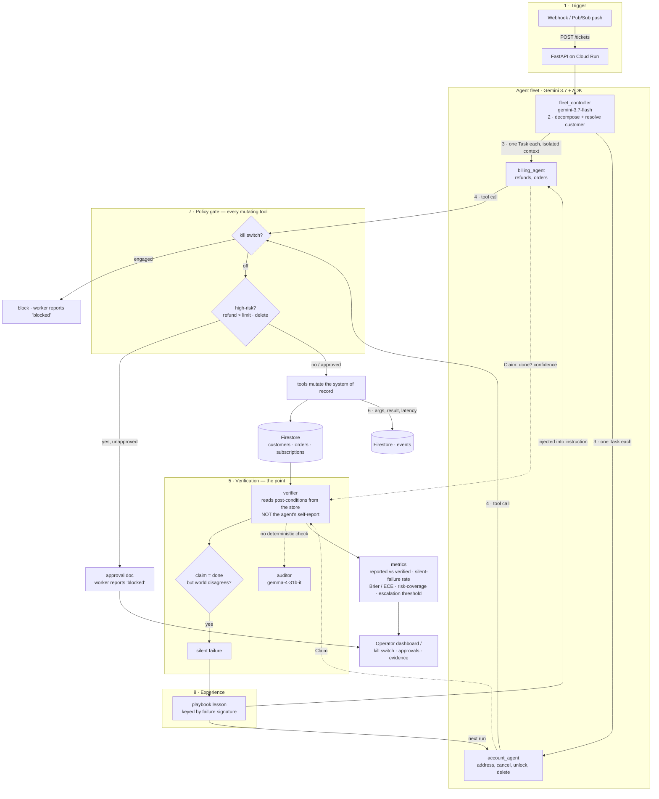

# Architecture — Attest Fleet

## The fleet and the governance layer

## Why the topology matters for scoring

- **Decoupling (30% Architectural Discipline).** Workers never talk to each other and never see the
  ticket — the controller hands each one an isolated `Task`. That isolation is what makes a per-task
  claim independently verifiable. Skill/tool/state are separate concerns (ADK tools, policy callbacks,
  Firestore), not collapsed into prompt strings.
- **Beyond chat (40% Operational Utility).** The trigger is an enterprise event (webhook/Pub/Sub), the
  fleet executes real mutations against a system of record, and high-risk actions are gated and
  reversible. No chat box anywhere.
- **Provable (30% Demo/Production-Readiness).** Every tool call is captured as evidence; the verifier
  produces a measured silent-failure rate; the dashboard shows it live on Cloud Run.

## Agent identity list

Served live at `GET /fleet/identities`.

| Agent | Model | Capability boundary | Mutates | Collaborates with |
|---|---|---|---|---|
| `fleet_controller` | gemini-3.7-flash | Decompose ticket, resolve customer (read-only tools) | no | billing_agent, account_agent |
| `billing_agent` | gemini-3.7-flash | Refunds, order reads | yes (gated) | fleet_controller |
| `account_agent` | gemini-3.7-flash | Address, cancel, unlock, delete | yes (gated) | fleet_controller |
| `vision_reader` | gemini-3.7-flash | Read an image attached to a ticket (screenshot, receipt, photo) into text | no | fleet_controller |
| `auditor` | **gemma-4-31b-it** | Verify tasks with no deterministic post-condition — a different model family, so it doesn't share the workers' blind spots | no | — |

## Model tiers and the fallback cascade

Every model id is env-configurable (`ATTEST_CONTROLLER_MODEL`, `ATTEST_WORKER_MODEL`,
`ATTEST_VISION_MODEL`, `ATTEST_AUDITOR_MODEL`) and each role runs a cascade rather than a
single model, because a newly released Flash tier is demand-shed (HTTP 503) for weeks after
launch and a 503 must not lose a ticket:

| Role | Cascade |
|---|---|
| `fleet_controller`, `billing_agent`, `account_agent`, `vision_reader` | `gemini-3.7-flash` → `gemini-3.6-flash` → `gemini-3.5-flash-lite` |
| `auditor` | `gemma-4-31b-it` → `gemma-4-26b-a4b-it` |

The Gemini roles degrade within the Gemini family; the auditor degrades within the Gemma
family so that it stays a different model family from the workers and keeps the
independence that makes its verdict worth anything. The chains are defined in
`src/attest_fleet/config.py` and the resolved selection is served at `GET /health`.

The failure-mode table is in the [README](../README.md#failure-mode-table).
