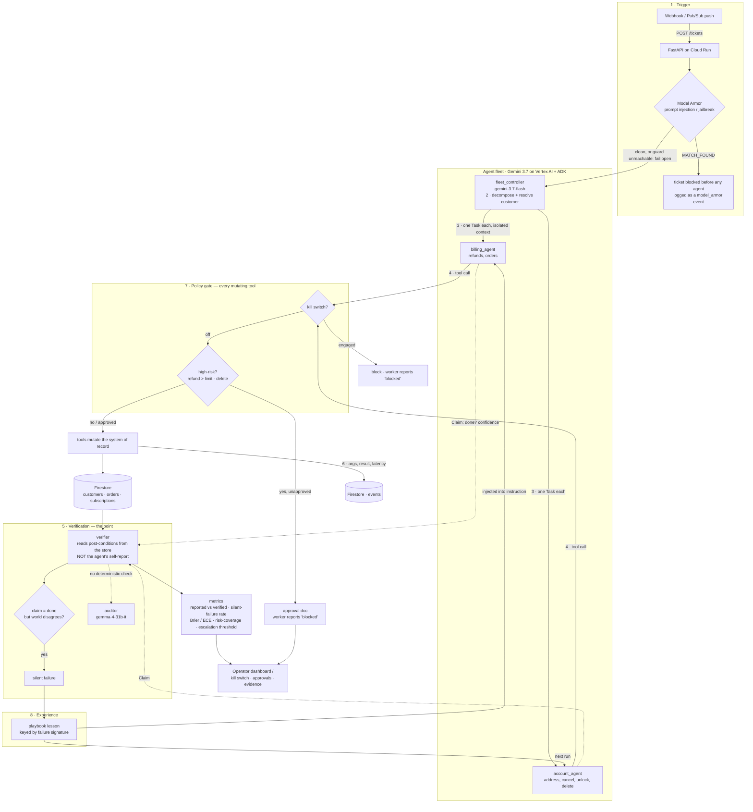

# Architecture — Attest Fleet

## The fleet and the governance layer

## Why the topology matters for scoring

- **Decoupling (30% Architectural Discipline).** Workers never talk to each other and never see the
  ticket — the controller hands each one an isolated `Task`. That isolation is what makes a per-task
  claim independently verifiable. Skill/tool/state are separate concerns (ADK tools, policy callbacks,
  Firestore), not collapsed into prompt strings.
- **Beyond chat (40% Operational Utility).** The trigger is an enterprise event (webhook/Pub/Sub), the
  fleet executes real mutations against a system of record, and high-risk actions are gated and
  reversible. No chat box anywhere.
- **Provable (30% Demo/Production-Readiness).** Every tool call is captured as evidence; the verifier
  produces a measured silent-failure rate; the dashboard shows it live on Cloud Run. ADK's
  OpenTelemetry GenAI spans export to Cloud Trace, so the reasoning trail and the outcome
  evidence can be read side by side.

## Agent registry and identities

Served live at `GET /fleet/identities`, which is a read from Google's **Agent Registry**, not a
hardcoded manifest. `scripts/register_agents.py` publishes each agent as an A2A agent card, one
registry service each, with every tool indexed as a skill and tagged mutating or read-only. The
endpoint returns `{"source": "agent-registry", "count": 5, "agents": [...]}` with a per-agent
`registry` block, and falls back to the in-code list (`"source": "local"`) when the registry is
unreachable, so tests and local runs need no cloud access. The table below is that in-code
fallback, which also supplies the deployment facts the registry does not carry: the resolved
model, and whether the agent mutates.

| Agent | Model | Capability boundary | Mutates | Collaborates with |
|---|---|---|---|---|
| `fleet_controller` | gemini-3.7-flash | Decompose ticket, resolve customer (read-only tools) | no | billing_agent, account_agent |
| `billing_agent` | gemini-3.7-flash | Refunds, order reads | yes (gated) | fleet_controller |
| `account_agent` | gemini-3.7-flash | Address, cancel, unlock, delete | yes (gated) | fleet_controller |
| `vision_reader` | gemini-3.7-flash | Read an image attached to a ticket (screenshot, receipt, photo) into text | no | fleet_controller |
| `auditor` | **gemma-4-31b-it** | Verify tasks with no deterministic post-condition — a different model family, so it doesn't share the workers' blind spots | no | — |

## Model tiers and the fallback cascade

Every model id is env-configurable (`ATTEST_CONTROLLER_MODEL`, `ATTEST_WORKER_MODEL`,
`ATTEST_VISION_MODEL`, `ATTEST_AUDITOR_MODEL`) and each role runs a cascade rather than a
single model, because a newly released Flash tier is demand-shed (HTTP 503) for weeks after
launch and a 503 must not lose a ticket:

| Role | Cascade |
|---|---|
| `fleet_controller`, `billing_agent`, `account_agent`, `vision_reader` | `gemini-3.7-flash` → `gemini-3.6-flash` → `gemini-3.5-flash` |
| `auditor` | `gemma-4-31b-it` → `gemma-4-26b-a4b-it` |

The bottom rung is `gemini-3.5-flash` because Vertex does not serve `-lite`; on a Gemini
Developer API key the floor is `gemini-3.5-flash-lite` instead, and `config.py` selects the
right one for the active backend.

The Gemini roles degrade within the Gemini family; the auditor degrades within the Gemma
family so that it stays a different model family from the workers and keeps the
independence that makes its verdict worth anything. The chains are defined in
`src/attest_fleet/config.py` and the resolved selection is served at `GET /health`.

## Backends: Vertex AI for Gemini, the Developer API for Gemma

The Gemini roles run on **Vertex AI** (location `global`, which is where 3.7 and 3.6 are
served), billed to the project, so the fleet is not capped by the Developer API free tier.
Gemma is not a Vertex publisher model, so the auditor keeps a Gemini Developer API key. That
split is worth more than it costs: the auditor now reaches its model through a different
**backend** as well as a different model **family**, which is a stronger form of the
independence its verdict depends on. `config.on_vertex()` makes the routing decision per model
id and `config.client_kwargs_for()` builds the matching client, so a single env flag
(`ATTEST_USE_VERTEX=0`) routes every role back through one Developer API key.

The failure-mode table is in the [README](../README.md#failure-mode-table).
